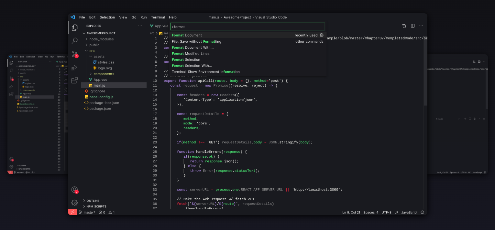

<h1>

<b>Werewolf Official</b>
</h1>

> A dark theme for [VS code](https://code.visualstudio.com/).

## Installation

1. Open the extensions sidebar on Visual Studio Code
1. Search for Theme
1. Click Install
1. Click Reload to reload your editor
1. Select the Manage Cog (bottom left) > Color Theme ＞ Theme
1. ⭐⭐⭐⭐⭐ Rate five-stars 🎃

## Credits

* [Dracula Color Theme](https://draculatheme.com/visual-studio-code) for VS Code.
* [Freepik](https://www.flaticon.com/br/autores/freepik) for the amazing Icon.

[MIT License](./LICENSE) © Werewolf Theme
